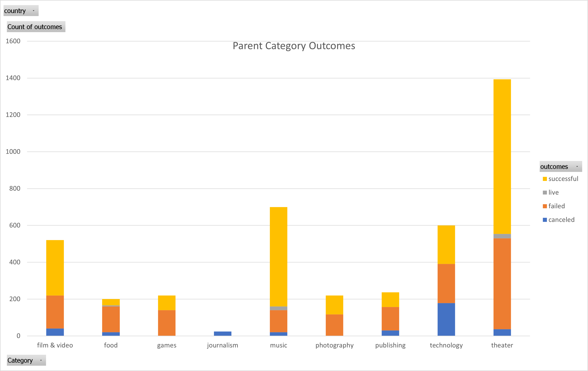
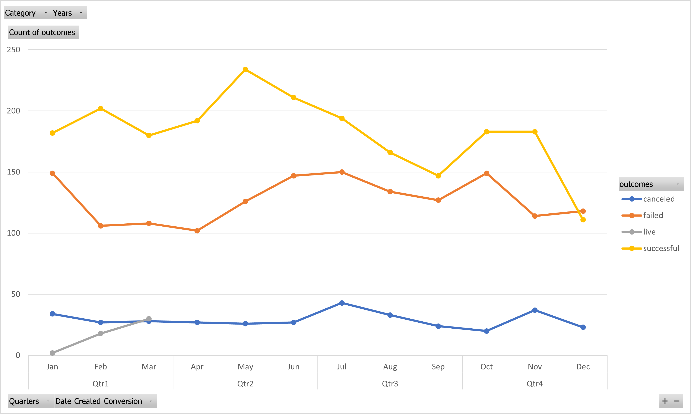

# kickstarter-analysis
Analysis performed on Kickstarter data to reveal trends on theater campaigns.

### Parent Category Outcomes
Overall, the most successful Kickstarter category was 'theater', with 839 successful campaigns. 

### Outcomes Based On Launch Date
The month of May appears to be the best time to launch a Kickstarter theater campaign, while December is the worst time to launch a Kickstarter theater campaign.

