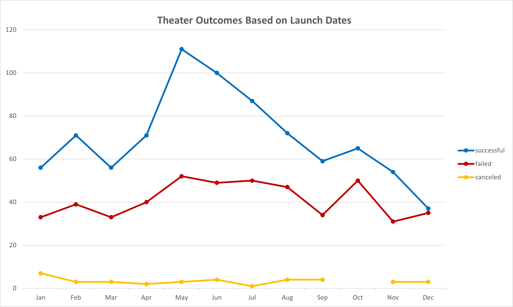
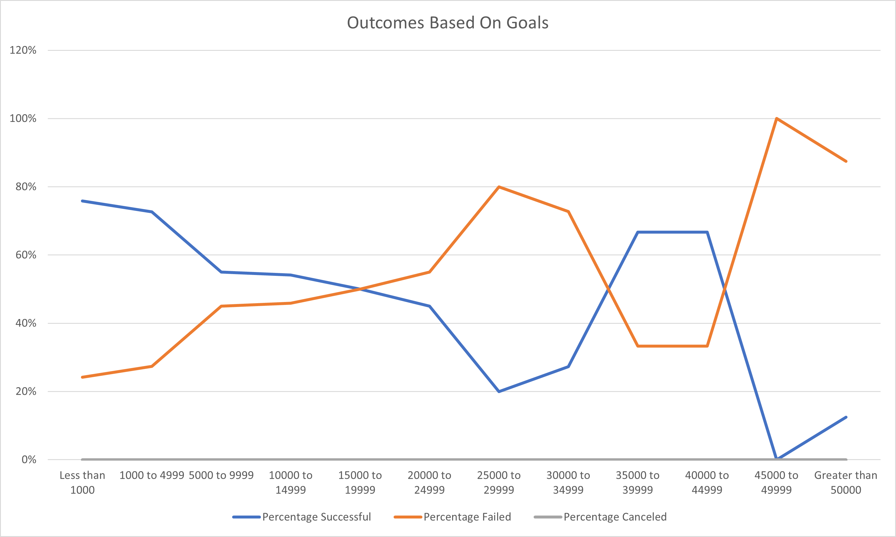

# Kickstarting with Excel
A client's theater production came close to its fundraising goal on Kickstarter in a short amount of time and they wanted to know how other campaigns fared in relation to their launch dates and fundraising goal.  

## Overview of Project
Using a Kickstarter dataset, campaign outcomes based on their launch dates and fundraising goals were visualized using Excel.

### Purpose
Organizing, analyzing, and visulaizing the Kickstarter dataset tells a better story than simply submitting an Excel spreadsheet of 4000+ rows of data.  Visualizing the analysis through line charts quickly tells an easily understandable story, outcome, or trend.

## Analysis and Challenges
* Overall, the Kickstarter dataset was fairly easy to work with.  The data was structured and needed minimal cleaning.

* Dates and times in the Kickstarter dataset first needed to be converted from Unix epoch time into a human-readable format.  Many web browsers and databases store date and timestamps in this format, so conversion is frequently needed.  Unix epoch time '1474958434' was converted with the following Excel formula:

> =(((J4106/60)/60)/24)+DATE(1970,1,1)

This converted the date and time stamp to 9/27/2016.

* The Kickstarter dataset needed an additional column in order to visualize theater campaign outcomes based on the month it was launched.  All of the dates were in the newly converted format of DD/MM/YYYY, but for the 'Theater Outcomes by Launch Date' sheet, the year needed to be extracted from the date so the data in the pivot table could be filtered by year.  The year was extracted with the following Excel formula:

> =YEAR(S4106)

This extracted the year from cell S4106.  The YEAR formula was applied to all cells in Column S.

* Ensuring there weren't any typos in the Excel formulas in the 'Outcomes Based On Goals' sheet was also challenging at times.  When typing rows of data for the 'Goals' column in the 'Outcome Based On Goals' or typing out the COUNTIFS formula for 'Number of Successful...' column cells, it was easy to enter the wrong number or type a "<" when ">" was actually intended.  Some of the typed goals or formulas needed to be double- or triple-checked for accuracy if the results did not make sense.  The following COUNTIFS formula was used to gather the number of successful Kickstarter play campaigns with goals between $1,000 and $4,999:

> =COUNTIFS(Kickstarter!$F:$F, "successful", Kickstarter!$D:$D, ">=1000", Kickstarter!$D:$D, "<=4999", Kickstarter!$R:$R, "plays")

The COUNTIFS formula took the data from Column F of the Kickstarter sheet and counted all outcomes that were successful, counted values that were between $1,000 and $4,999 in Column D, and counted all occurrences of subcategory "plays" in Column R.

All criteria in the COUNTIFS formula need to be met in order to count.

This formula was modified for the other 11 goals and for each outcome of successful, failed, and canceled.

* Obtaining the sum of successful, failed, and canceled outcomes in the 'Outcomes Based On Goals' sheet utilized the following formula:

> =SUM(B3:D3)

This formula takes the sum of cells within range of B3-D3 and was modified for all goal rows and outcome columns.

### Analysis of Outcomes Based on Launch Date
The month of May appears to be the most successful time to launch a theater campaign on Kickstarter.  December appears to be the worst time to launch this type of campaign.

### Analysis of Outcomes Based on Goals
Kickstarter theater campaigns with goals between $45,000-49,999 had a 100% failure rate.  Campaigns with goals of less than $1,000, $1,000-4,999, $35,000-34,999, and $40,000-44,999 were successfule 67-73% of the time.

### Challenges and Difficulties Encountered
* Using GitHub and writing this analysis in markdown was a challenge because it is something that is not very familiar.

* There was a challenge in overthinking the interpretation of the Oucomes Based on Goals chart.  Since analysis of charts has not been covered yet, it was determined to stick with what was obvious that the chart displayed.

* Using COUNTIFS was familiar, but could be difficult for aspiring data analysts that are not comfortable with Excel and formulas.  COUNTIFS requires a range of data to count and the criteria used, and when analyzing multiple ranges and criteria, care needs to be taken to ensure the correct ranges are selected and the criteria is spelled the same way as in the referenced sheet.

* Pivot tables were also familiar, but could be challenging for those that have never used them.  Selecting which fields should go under Filters, Columns, Rows, or Values all depends on what the data analyst is trying to visualize, but this Excel feature is flexible and becomes easier to use with more experience.

## Results
- What are two conclusions you can draw about the Outcomes based on Launch Date?
   * The data for the theater category for the KickStarter dataset spanned nine years, from 2009-2017, but of those nine years, six did not have any data for the month of May.  The years 2014, 2015, and 2016 contained the most data and also contained data for May.  The years 2009, 2010, 2011, 2012, 2013, and 2017 contained anywhere from zero to 31 theater campaigns.

   * Kickstarter theater campaigns appear to have a fairly low chance of being canceled and do not seem to depend on the month.  Canceled campaigns ranged anywhere from zero to seven occurrences.

- What can you conclude about the Outcomes based on Goals?
   * There were zero canceled plays in this Kickstarter dataset, so the percentage of successful and failed campaigns mirror each other.  If a campaign had a goal of less than $1,000 and was 76% successful, then 24% failed.  

   * The Outcomes Based on Goals chart had one campaign goal that had an even split:
      * Kickstarter campaign goals between $15,000 and $19,999 for plays had a 50% success and failure rate
 
 
- What are some limitations of this dataset?
   * A majority of the Kickstarter data is for campaigns from the United States (3,038).  With the exception of Canada (146) and Great Britain (604), the remaining countries represented in this dataset did not break 100 campaign occurrences and ranged anywhere from one campaign (Singapore) to 74 campaigns (Australia).

   * There were 25 Kickstarter campaigns with goals above $1,000,000, and one campaign went as high as having a goal of $100,000,000.  All of these campaigns either failed or were cancelled.  If a data analyst were to calculate or chart the average goal, these campaigns could throw off the average and potentially misrepresent the dataset as a whole.

- What are some other possible tables and/or graphs that we could create?
   * In addition to making the same type of tables and graphs for other Kickstarter categories and subcategories, a data analyst could compare categories, countries, and average donation amounts with a line chart.

   * A data analyst could also show the most popular type of Kickstarter parent categories with a pie chart.

   * Calculating average campaign length in days versus outcome for all Kickstarter data or by campaign would give a prospective client a better idea of how long their campaign should be.  A bar graph could be used to represent this data.
